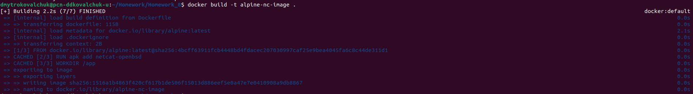

# Alpine Netcat Server-Client

## How to build images
```bash
docker build -t alpine-nc-image .
```
Result:


## How to create network
```bash
docker network create --driver bridge my-bridge-network
```
Result:


## How to run containers
Server:
```bash
docker run -it \
    --name server-container \
    --network my-bridge-network \
    -v "$PWD/server.sh":/app/server.sh \
    alpine-nc-image ./server.sh
```

Client:
```bash
docker run -it \
    --name client-container \
    --network my-bridge-network \
    -v "$PWD/client.sh":/app/client.sh \
    alpine-nc-image ./client.sh
```

Result after running server and client containers:


## Commands to verify containers connectivity between container
1. Run server:
```bash
sudo docker run --rm -it \
    --name server-container \
    --network my-bridge-network \
    alpine-nc-image
```

2. Run client:
```bash
sudo docker run --rm -it \
    --name client-container \
    --network my-bridge-network \
    alpine-nc-image
```

3. In client-container's shell, use:
```bash
ping server-container
```

4. Result:


## Commands to verify netcat scripts
1. Enter container's shell(in this example is used server-container):
```bash
docker run -it \
    --name server-container \
    --network my-bridge-network \
    -v "$PWD/server.sh":/app/server.sh \alpine-nc-image
```
2. Then, check files in current directory:
```bash
ls
```

3. Result:

